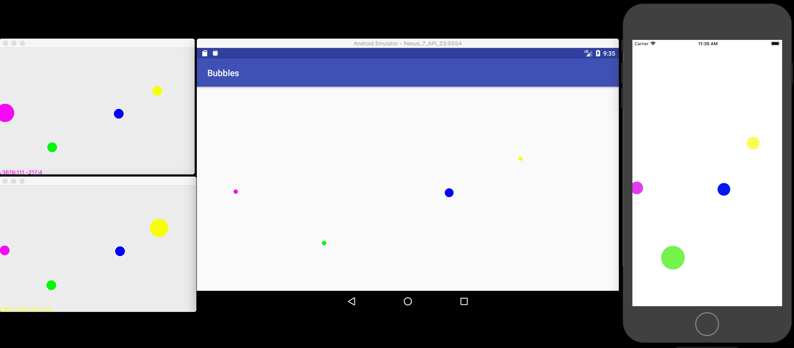

# bubbles - sample client-server application using SolidFrame

Exemplifies how to use SolidFrame mpipc library in a secured (SSL) client-server scenario.

[client/android](client/android) is an example of how to use SolidFrame framework and especially the solid::frame::mpipc library allong with BoringSSL and Snappy in an Android Java application.
[client/ios](client/ios) is and example of how to use SolidFrame allong with BoringSSL and Snappy as CocoaPods in an iOS Swift application.

## Insight

__bubbles__ is a client-server application. It consists of:
 * a server (runs on Linux/macOS/FreeBSD)
 * a client running on
   * Linux using Qt for GUI
   * macOS using Qt for GUI
   * Android using Java Native Interface

### The client

The client displays multiple moving bubbles:
 * one bigger bubble - the personal one which can be moved by the user (via mouse or touch) and/or automatically by a bubble "auto pilot".
 * other smaller bubbles, one for every other client registered on the same room on the server.

So, every client will display in real time all the bubbles in a room at the position in the client they originate.

||
|:---|
|__Linux:__|
||
|__macOS & Android Emulator & iOS Simulator:__|
||

#### Implementation
The frontend is implemented using either
 * Qt (for desktop clients);
 * Java for Android application;
 * Swift for iOS application.

The backend engine is implemented in C++ and relies on
 * **solid_frame** libraries (especially **solid_frame_mpipc** for communication)
 * **OpenSSL** (for desktop) / **BoringSSL** (for Android and iOS) - to secure the communication
 * **snappy** for all (Desktop Qt/Android/iOS) versions - to compress communication


### The server

 * keeps multiple connections grouped by the room they registered onto
 * register clients giving them an unique per room color
 * receives position updates from all the clients and further
 * pushes the updates to all other clients in the room 

#### Implementation

The server is a C++ application using **solid_frame** libraries (most important **solid_frame_mpipc** for communication), **OpenSSL** to secure communication and **boost** for parsing command line parameters.

### Workflow
 * the client connects to the server and registers on a room using either a given color or requesting a new color
 * the server will respond with a unique color (which may not be the requested one) and push to the client the positions and colors of all other bubbles in the room
 * the client will start displaying the bubbles
 * the client will send its initial bubble position
 * the client will continue sending the personal bubble position when it changes
 * the server will continue to push other bubbles position changes to the client.


## Getting started ...

### ... with the server ...

#### ... on Linux/macOS/FreeBSD

SolidFrame can be use either installed:

```bash
$ mkdir ~/work
$ cd ~/work
$ git clone git@github.com:vipalade/solidframe.git
$ mkdir extern
$ cd external
$ ../solidframe/prerequisites/prepare_extern.sh
# ... wait until the prerequisites are built
$ cd ../solidframe
$ ./configure -e ~/work/external --prefix ~/work/external
$ cd build/release
# makes and installs solidframe in ~/work/external
$ make install
# clone bubbles
$ cd ~/work
$ git clone https://github.com/vipalade/bubbles.git
$ cd ~/work/bubbles/
$ mkdir -p build/debug
$ cd build/debug
# only use the external folder
$ cmake -DEXTERN_PATH=~/work/external ../../
$ cd server/main
$ make
```
or it can be used directly from the directory it was built:

```bash
$ mkdir ~/work
$ cd ~/work
$ git clone git@github.com:vipalade/solidframe.git
$ mkdir external
$ cd external
$ ../solidframe/prerequisites/prepare_extern.sh
# ... wait until the prerequisites are built
$ cd ../solidframe
$ ./configure -e ~/work/external
$ cd build/release
$ make
# clone bubbles
$ cd ~/work
$ git clone https://github.com/vipalade/bubbles.git
$ cd ~/work/bubbles/
$ mkdir -p build/release
$ cd build/release
$ cmake -DCMAKE_BUILD_TYPE=release -DEXTERN_PATH=~/work/external -DSolidFrame_DIR=~/work/solidframe/build/release ../../
$ cd server/main
$ make

```

run the server with secure communication enabled:

```bash
$ ./bubbles_server -p 4444
```

or, run the server with plain communication:

```bash
$ ./bubbles_server -p 4444 -s 0
```


### ... with Qt client ...

#### ... Linux/macOS/FreeBSD

First you'll need to download precompiled Qt from [here](http://download.qt.io/official_releases/qt/5.9/5.9.2/qt-opensource-linux-x64-5.9.2.run):

```bash
$ cd ~/work/external
$ curl -L -O http://download.qt.io/official_releases/qt/5.9/5.9.2/qt-opensource-linux-x64-5.9.2.run
$ chmod +x qt-opensource-linux-x64-5.9.2.run
$ ./qt-opensource-linux-x64-5.9.2.run
# ... follow the installation steps, and install qt (only "Desktop gcc 64-bit" is needed) in ~/work/external/qt/
```

Next, you'll have to install Qt dependencies. E.g. on Fedora:

```bash
$ sudo dnf install mesa-libGL-devel
```

next, configure the **bubbles** build to also compile the Qt client:

```bash
$ cd ~/work/bubbles/
$ cd build/release
# reconfigure with path to QtWidget:
$ cmake -DCMAKE_BUILD_TYPE=release -DEXTERN_PATH=~/work/external -DSolidFrame_DIR=~/work/solidframe/build/release -DQt5Widgets_DIR=~/work/external/qt/5.9.2/gcc_64/lib/cmake/Qt5Widgets ../../
$ cd client/qt
$ make
```

finally, run the client with secure communication:

```bash
# launch multiple bubbles clients:
$ ./bubbles_client -c localhost:4444 &
$ ./bubbles_client -c localhost:4444 &
$ ./bubbles_client -c localhost:4444 &
$ ./bubbles_client -c localhost:4444 &
```
or, run the client with plain communication:

```bash
# launch multiple bubbles clients:
$ ./bubbles_client -c localhost:4444 -s 0 &
$ ./bubbles_client -c localhost:4444 -s 0 &
$ ./bubbles_client -c localhost:4444 -s 0 &
$ ./bubbles_client -c localhost:4444 -s 0 &
```

Launching the clients without any parameters will try to connect to a default internet server (not always online!).

#### ... on Windows 10 and Visual Studio 2017

Prerequisites:
 * Visual Studio 2017
 * [CMake](https://cmake.org/)
 * [Git for Windows](https://git-scm.com/download/win) - the build workflow uses Git Bash so it must be installed
 * [Perl for Windows](http://strawberryperl.com/) - it is needed to build OpenSSL for Windows. Windows Git Bash installation also comes with __perl__ but it won't work with OpenSSL build.
 * [Qt for Windows](https://www.qt.io/download-qt-installer)
 * [SolidFrame](https://github.com/vipalade/solidframe.git)

Install Qt:
 * Download and run the [Qt installer](https://www.qt.io/download-qt-installer).
 * A minimum installation should contain the "Qt 5.10.1" -> "MSVC 2017 64-bit" pre-built binaries.
 * Next we suppose that Qt installation folder is "c:\qt".
 * Add "C:\qt\5.10.1\msvc2017_64\bin" to system path environment variable - this is needed for Qt*.dll search.

Next are all the commands needed to build bubbles_client Qt application on Windows with all the prerequisites issued in a Git Bash console:

```bash
$ mkdir ~/work
$ cd ~/work
$ mkdir external
$ git clone https://github.com/vipalade/solidframe.git
$ git clone https://github.com/vipalade/bubbles.git
$ cd external
$ ../solidframe/prerequisites/run_in_vs2017_env.sh amd64 bash
$ ../solidframe/prerequisites/prepare_external.sh --boost --openssl --64bit
$ cd ../solidframe
$ ./configure -b maintain -f vsmnt64 -e ~/work/external -g "Visual Studio 15 2017 Win64"
$ cd build/vsmnt64
# only build the libraries
$ cmake --build . --config release --target libraries
# move to bubbles folder
$ cd ~/work/bubbles
$ mkdir -p build/vsmnt64
$ cd build/vsmnt64
$ cmake -DCMAKE_BUILD_TYPE=maintain -DEXTERNAL_PATH=~/work/external -DSolidFrame_DIR=~/work/solidframe/build/vsmnt64/ -DQt5Widgets_DIR=/c/qt/5.10.1/msvc2017_64/lib/cmake/Qt5Widgets -G "Visual Studio 15 2017 Win64" ../../
$ cmake --build . --config release --target bubbles_client
```


### With Android client

```bash
$ git clone --recursive https://github.com/vipalade/bubbles.git
```

 * load bubbles/client/android project in Android Studio >= 3.0 (tested on macOS and Linux)
 * run the application from there either within emulator or on phisical device.
 
#### NOTES

 * **BoringSSL** and **SolidFrame** libraries are used as git modules (i.e. the CMakeLists.txt of the native lib (client/android/app/CMakeLists.txt) directly embeds the CMakeList.txt files of **BoringSSL** and **SolidFrame**.
 * **snappy** on the other hand is used as an external project (using ExternalProject_Add).
 * Although all libraries can be built as external projects, I'll maintain this status quo as an example of how to use git modules.
 * _Lesson learned_: For the ExternalProject_Add with **snappy** to work propperly (i.e. the native-lib to be able to link with libsnappy.a), I had to add "BUILD_BYPRODUCTS ${CMAKE_CURRENT_BINARY_DIR}/external/lib/libsnappy.a" field to ExternalProject_Add.
 * _Lesson learned_: Building **BoringSSL** needs [**Go Programming Language**](https://golang.org/) to be installed on the sistem. So, when building **Bubbles** from within AndroidStudio, **Go** will be called via *gradle* -> *cmake* and at this point **Go** has to, somehow be in the PATH variable. This seems not to be a problem when running Android Studio on Linux, but on macOS, **Go** installs itself in PATH environment variable available from the Terminal but it is not available from applications - like Android Studio. The simplest solution is to **launch Android Studio application from a terminal**.
 
### With iOS client

First, one needs to have CocoaPods [installed](https://cocoapods.org/#install):

```bash
$ sudo gem install cocoapods
```

```bash
$ git clone https://github.com/vipalade/bubbles.git
$ cd bubbles/client/ios/bubbles
$ pod install
$ open bubbles.xcworkspace
```
